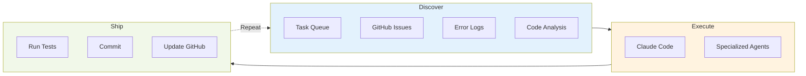

# Sugar 🍰

Claude Code running in a loop, working through your task list autonomously.

Sugar builds features, fixes bugs, and ships code while you focus on what matters. It's like having a dev team that never stops.

## What It Does

Think of Sugar as **Claude Code with persistence**. Instead of one-off interactions:

- **Continuous execution** - Runs 24/7, working through your task queue
- **Builds features** - Takes specs, implements, tests, commits working code
- **Fixes bugs** - Reads error logs, investigates, implements fixes
- **GitHub integration** - Creates PRs, updates issues, tracks progress
- **Smart discovery** - Finds work from errors, issues, and code analysis

You plan the work. Sugar executes it.

## Install

```bash
pip install sugarai
```

Or use uv (much faster):
```bash
uv pip install sugarai
```

## Quick Start

```bash
# Initialize in your project
cd your-project
sugar init

# Add tasks to the queue
sugar add "Fix authentication timeout" --type bug_fix --urgent
sugar add "Add user profile settings" --type feature

# Start the loop
sugar run
```

Sugar will:
1. Pick up tasks from the queue
2. Execute them using Claude Code
3. Run tests and verify changes
4. Commit working code
5. Move to the next task

It keeps going until the queue is empty (or you stop it).

## Real Example

```bash
# Monday morning: Load up the week's work
sugar add "Implement OAuth login" --type feature --priority 4
sugar add "Fix memory leak in auth module" --type bug_fix --urgent
sugar add "Add integration tests for API" --type test

# Start autonomous mode
sugar run

# Check progress anytime
sugar status
sugar list --status completed

# Sugar handles:
# - Writing the code
# - Running tests
# - Making commits
# - Creating PRs (if configured)
# - Updating GitHub issues
```

## Features

**Task Management**
- Rich task context with priorities and metadata
- Custom task types for your workflow
- Queue management and filtering

**Autonomous Execution**
- Specialized Claude agents (UX, backend, QA)
- Automatic retries on failures
- Quality checks and testing

**GitHub Integration**
- Reads issues, creates PRs
- Updates issue status automatically
- Commits with proper messages

**Smart Discovery**
- Monitors error logs
- Analyzes code quality
- Identifies missing tests
- Auto-creates tasks from findings

## How It Works



Sugar runs continuously, cycling through discovery → execution → shipping. Each cycle can handle multiple tasks in parallel.

## Configuration

`.sugar/config.yaml` is auto-generated on `sugar init`. Key settings:

```yaml
sugar:
  dry_run: false              # Set to true for testing
  loop_interval: 300          # 5 minutes between cycles
  max_concurrent_work: 3      # Parallel task execution

claude:
  enable_agents: true         # Use specialized Claude agents

discovery:
  github:
    enabled: true
    repo: "user/repository"
  error_logs:
    enabled: true
    paths: ["logs/errors/"]
  code_quality:
    enabled: true
```

## Requirements

- Python 3.11+
- [Claude Code CLI](https://docs.anthropic.com/en/docs/claude-code)

## Documentation

- **[Quick Start](docs/user/quick-start.md)** - Get running in 5 minutes
- **[CLI Reference](docs/user/cli-reference.md)** - All commands
- **[GitHub Integration](docs/user/github-integration.md)** - Connect to GitHub
- **[Configuration Guide](docs/user/configuration-best-practices.md)** - Best practices
- **[Claude Code Plugin](.claude-plugin/README.md)** - Native integration

## Advanced Usage

**Custom Task Types**
```bash
sugar task-type add deployment --name "Deployment" --emoji "🚀"
sugar add "Deploy to staging" --type deployment
```

**Complex Tasks with Context**
```bash
sugar add "User Dashboard" --json --description '{
  "priority": 5,
  "context": "Complete dashboard redesign",
  "agent_assignments": {
    "ux_design_specialist": "UI/UX design",
    "frontend_developer": "Implementation",
    "qa_test_engineer": "Testing"
  }
}'
```

**Multiple Projects**
```bash
# Run Sugar on multiple projects simultaneously
cd /path/to/project-a && sugar run &
cd /path/to/project-b && sugar run &
cd /path/to/project-c && sugar run &
```

## Troubleshooting

**Sugar not finding Claude CLI?**
```bash
# Specify Claude path in .sugar/config.yaml
claude:
  command: "/full/path/to/claude"
```

**Tasks not executing?**
```bash
# Check dry_run is disabled
cat .sugar/config.yaml | grep dry_run

# Monitor logs
tail -f .sugar/sugar.log

# Test single cycle
sugar run --once
```

**Need help?**
- [Troubleshooting Guide](docs/user/troubleshooting.md)
- [GitHub Issues](https://github.com/cdnsteve/sugar/issues)

## Contributing

Contributions welcome! See [CONTRIBUTING.md](docs/dev/contributing.md) for guidelines.

```bash
# Development setup
git clone https://github.com/cdnsteve/sugar.git
cd sugar

# Install with uv (recommended)
uv pip install -e ".[dev,test,github]"

# Or with pip
pip install -e ".[dev,test,github]"

# Run tests
pytest tests/ -v

# Format code
black .
```

## License

MIT - see [LICENSE](LICENSE) and [TERMS.md](TERMS.md)

---

**Sugar v2.0.1** - Autonomous development for any project

> ⚠️ Sugar is provided "AS IS" without warranty. Review all AI-generated code before use. See [TERMS.md](TERMS.md) for details.
