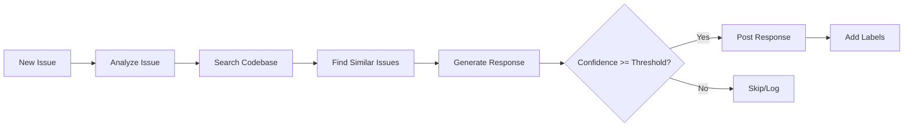

# Sugar Issue Responder - GitHub Action

AI-powered GitHub issue assistant that automatically analyzes issues and posts helpful responses.

Built on the [Claude Agent SDK](https://github.com/anthropics/claude-agent-sdk) and part of the [Sugar project](https://github.com/roboticforce/sugar).

## Features

- **Intelligent Analysis** - Uses Claude to understand issue context, type, and sentiment
- **Codebase Search** - Searches your repository for relevant files and code
- **Similar Issues** - Finds related past issues for context
- **Code References** - Includes specific file/line references in responses
- **Confidence Scoring** - Only auto-posts responses with high confidence
- **Customizable** - Configure thresholds, models, and behavior

## Quick Start

### 1. Add API Key Secret

Add your Anthropic API key to your repository secrets:
- Go to Settings → Secrets and variables → Actions
- Add `ANTHROPIC_API_KEY` with your API key

### 2. Create Workflow

Create `.github/workflows/issue-responder.yml`:

```yaml
name: Issue Responder

on:
  issues:
    types: [opened, reopened]
  issue_comment:
    types: [created]

permissions:
  issues: write
  contents: read

jobs:
  respond:
    runs-on: ubuntu-latest
    steps:
      - uses: actions/checkout@v4

      - name: Respond to Issue
        uses: roboticforce/sugar@main
        with:
          anthropic-api-key: ${{ secrets.ANTHROPIC_API_KEY }}
          mode: auto
          confidence-threshold: '0.7'
```

### 3. Test It

Open a new issue and watch Sugar analyze and respond!

## Configuration

### Inputs

| Input | Description | Required | Default |
|-------|-------------|----------|---------|
| `anthropic-api-key` | Anthropic API key for Claude | Yes | - |
| `github-token` | GitHub token for API access | No | `${{ github.token }}` |
| `mode` | Response mode: `auto`, `mention`, or `triage` | No | `auto` |
| `model` | Claude model to use | No | `claude-sonnet-4-20250514` |
| `confidence-threshold` | Minimum confidence to auto-post (0.0-1.0) | No | `0.7` |
| `max-response-length` | Maximum response length in characters | No | `2000` |
| `skip-labels` | Comma-separated labels to skip | No | `''` |
| `dry-run` | Generate but don't post responses | No | `false` |

### Outputs

| Output | Description |
|--------|-------------|
| `responded` | Whether a response was posted (`true`/`false`) |
| `confidence` | Confidence score of the response (0.0-1.0) |
| `response` | The generated response text |
| `issue-number` | The issue number that was processed |

## Usage Modes

### Auto Mode (Default)

Responds to all new issues automatically:

```yaml
with:
  mode: auto
  confidence-threshold: '0.7'
```

### Mention Mode

Only responds when `@sugar` is mentioned:

```yaml
with:
  mode: mention
```

Example issue:
```
Hey @sugar, can you help me understand this error?
```

### Triage Mode

Analyzes issues and adds labels without posting comments:

```yaml
with:
  mode: triage
```

## Advanced Examples

### High Confidence Only

Only post responses you're very confident about:

```yaml
- uses: roboticforce/sugar@main
  with:
    anthropic-api-key: ${{ secrets.ANTHROPIC_API_KEY }}
    confidence-threshold: '0.9'
```

### Skip Certain Labels

Don't respond to issues with specific labels:

```yaml
- uses: roboticforce/sugar@main
  with:
    anthropic-api-key: ${{ secrets.ANTHROPIC_API_KEY }}
    skip-labels: 'wontfix,duplicate,needs-human-review'
```

### Use Claude Opus

For maximum quality:

```yaml
- uses: roboticforce/sugar@main
  with:
    anthropic-api-key: ${{ secrets.ANTHROPIC_API_KEY }}
    model: 'claude-opus-4-5-20251101'
    confidence-threshold: '0.8'
```

### Dry Run Testing

Test without posting:

```yaml
- uses: roboticforce/sugar@main
  with:
    anthropic-api-key: ${{ secrets.ANTHROPIC_API_KEY }}
    dry-run: 'true'
```

Then check the action logs to see what would have been posted.

### With Conditional Logic

```yaml
- name: Respond to Issue
  id: responder
  uses: roboticforce/sugar@main
  with:
    anthropic-api-key: ${{ secrets.ANTHROPIC_API_KEY }}

- name: Notify Team
  if: steps.responder.outputs.responded == 'true'
  run: |
    echo "Sugar responded to issue #${{ steps.responder.outputs.issue-number }}"
    echo "Confidence: ${{ steps.responder.outputs.confidence }}"
```

## How It Works



1. **Issue Analysis** - Classifies type (bug/feature/question), extracts key topics
2. **Codebase Search** - Finds relevant files, functions, and patterns
3. **Similar Issues** - Searches for related past issues
4. **Response Generation** - Claude creates a helpful response with code references
5. **Confidence Check** - Only posts if confidence meets threshold
6. **Post & Label** - Adds response and suggested labels

## Response Quality

Sugar aims for high-quality responses:

- **Welcoming tone** - Friendly and helpful
- **Code references** - Links to specific files and lines
- **Concrete guidance** - Actionable next steps
- **Context-aware** - Understands your codebase

Confidence scores:
- **0.9-1.0** - Very confident, verified in code
- **0.7-0.9** - Confident based on patterns
- **0.5-0.7** - Moderate uncertainty
- **0.0-0.5** - Low confidence, skipped

## Security & Privacy

- **Bring Your Own Key (BYOK)** - Use your own Anthropic API key
- **Repository access** - Only reads public files (or private if repo is private)
- **No data storage** - Sugar doesn't store your code or issues
- **Configurable** - Full control over what gets posted

## Pricing

Sugar is free and open source. You only pay for:
- Anthropic API usage (Claude API costs)
- GitHub Actions minutes (free tier available)

Typical costs per issue response: ~$0.01-0.05 depending on model and issue complexity.

## Limitations

- Only works on public repositories or private repos with appropriate permissions
- Requires Anthropic API key (not free)
- Docker-based action (startup time ~30-60 seconds)
- Best results with well-structured codebases

## Troubleshooting

### Action fails with "No such file or directory"

Make sure you checkout the repository first:
```yaml
- uses: actions/checkout@v4
```

### No responses posted

Check:
1. `ANTHROPIC_API_KEY` is set correctly
2. Confidence threshold isn't too high
3. Issue doesn't have skip labels
4. Check action logs for errors

### Responses are poor quality

Try:
- Use a more powerful model (Opus instead of Sonnet)
- Lower confidence threshold (but may post less often)
- Add more documentation to your repository
- Check that issue descriptions are clear

## Support

- [Documentation](https://github.com/roboticforce/sugar)
- [Report Issues](https://github.com/roboticforce/sugar/issues)
- [Contributing Guide](https://github.com/roboticforce/sugar/blob/main/docs/dev/contributing.md)

## License

MIT - See [LICENSE](../LICENSE)

---

Built with the [Claude Agent SDK](https://github.com/anthropics/claude-agent-sdk)
